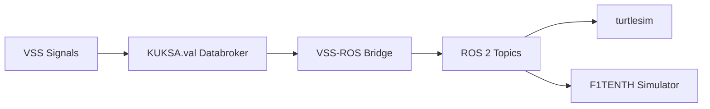

# VSS-ROS-Bridge

## Overview

VSS-ROS-Bridge provides a bridge between the KUKSA.val databroker and ROS 2. It subscribes to Vehicle Signal Specification (VSS) data points and publishes them as ROS topics, enabling control of simulators such as turtlesim and the F1TENTH simulator using standardized vehicle signals.

---

## Architecture



---

## Demo


---


## Technology Stack

* KUKSA.val
* COVESA Vehicle Signal Specification (VSS)
* ROS 2 Humble
* Docker and Docker Compose

---

## Project Structure

```bash
VSS-ROS-Bridge/
├── assets/
├── csv_provider/
├── f2tenth_simulator/
├── publisher/
├── scripts/
├── img/
├── docker-compose.yml
├── Dockerfile
├── README.md
└── LICENSE
```

---

## Prerequisites

* Unix-based environment
* Docker
* Docker Compose

---

## Getting Started

### Clone the repository

```bash
git clone https://github.com/LikhithST/VSS-ROS-Bridge.git
cd VSS-ROS-Bridge
```

---

### Optional configuration

Update environment variables in `docker-compose.yml` if needed:

* width
* height
* x_coord
* y_coord

---

### Run the system

```bash
docker compose up
```

This starts:

* KUKSA Databroker
* VSS-ROS Bridge
* ROS simulator

---

## Usage

### Send teleoperation commands

```bash
source ./scripts/setup.sh

cd csv_provider
python3 provider.py -f output_left_90_1x.csv
```

---

## Expected Behavior

* The simulator launches automatically
* The turtle or vehicle moves according to CSV input
* ROS topics reflect VSS signals

---

## KUKSA.val Quick Start

### Databroker

```bash
docker run -it --rm --net=host ghcr.io/eclipse/kuksa.val/databroker:master --insecure
```

### Databroker CLI

```bash
docker run -it --rm --net=host ghcr.io/eclipse/kuksa.val/databroker-cli:master
```

### Kuksa Client CLI

```bash
docker run -it --rm --net=host ghcr.io/eclipse-kuksa/kuksa-python-sdk/kuksa-client:main
```

---

## Use Cases

* Vehicle signal simulation
* ROS-based control systems
* Autonomous driving experimentation
* Automotive and robotics integration

---

## License

This project is licensed under the Apache License 2.0. See the LICENSE file for details.

---

## Contributing

Contributions are welcome through issues and pull requests.

---

## Acknowledgements

* Eclipse KUKSA Project
* COVESA VSS
* ROS 2 Community
